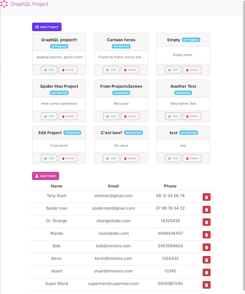
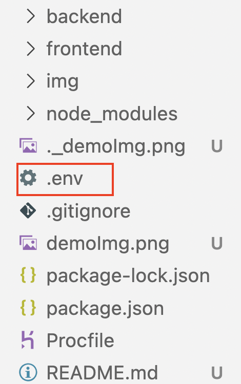
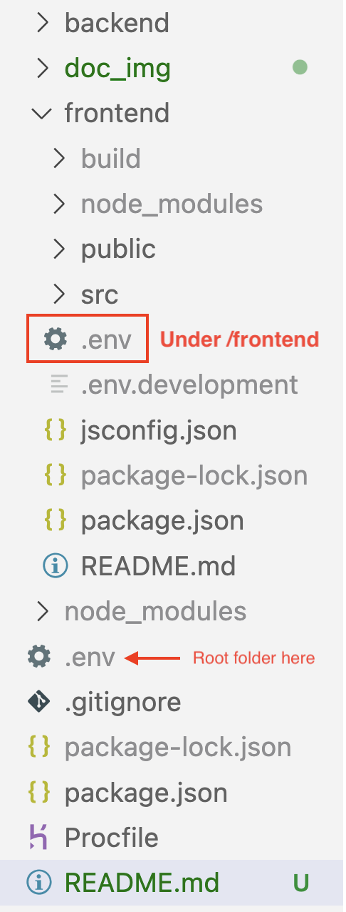

This is a React app with GraphQL using express-graphql server, MongoDB and apollo-client.

[View Deom page](https://62b5a6d7ca5cd90080189357--keen-truffle-fc8264.netlify.app/)

[](https://62b5a6d7ca5cd90080189357--keen-truffle-fc8264.netlify.app/)

You can add, delete and update the data.

## To run this project,

### 1. create `.env` file in the project `root`(see the image below)



and define variables like example below.

```

NODE_ENV='development'
PORT=4000
MONGO_URI='Your MongoDB URL'

```

NODE_ENV and PORT is optional but <mark>MONGO_URI</mark> is necessary.

### 2. create another `.env` under the `frontend` folder.



and define `REACT_APP_GRAPH_HOST` variable.

```

REACT_APP_GRAPH_HOST='your server adress/graphql'

```

Normally this value will be set to "http:localhost:[PORT]/graphql", while you're developing. But once you deploy your server, you need to change this value with the real adress(you can set the values on the hosting provider's site if they provid this function).

3. ### npm install

run this code in the project root, and under frontend folder too.

4. ### npm run dev

For development, it will run both of the server and the client.


